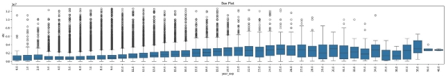
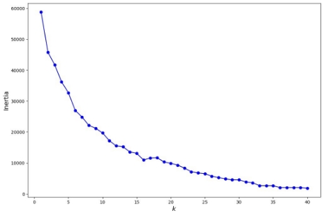
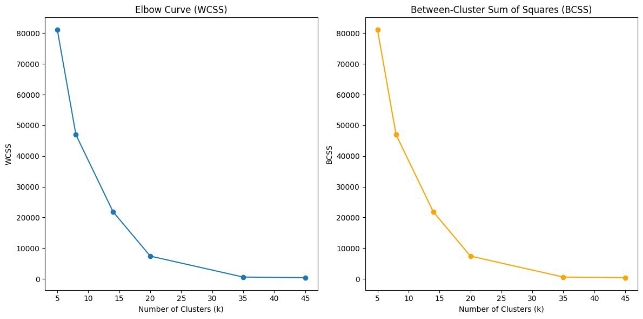
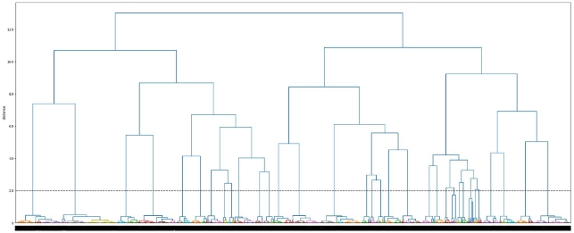

**Problem Statement:** The primary objective is 

1. Profile the best companies and job positions from Scaler's database.
1. To execute clustering techniques.
1. Evaluate the coherence of your clusters, and provide actionable insights for enhanced learner profiling and course tailoring.
1. To profile learners effectively to tailor course content, ensuring a more personalized and impactful learning experience.

**Questionaire:**

1. What percentage of users fall into the largest cluster?

Answer: We’ve created 20 clsuters based on 4 primary features Company, CTC, Appraisal, Year of Experience and in largest cluster we got : 10% (2595/26457) of my complete data.

2. Comment on the characteristics that differentiate the primary clusters from each other.

Primary Cluster charecteristics includes:

1. Salary bin Medium (5,00,000 to 15,00,000 ) 
1. Exp bin Medium (5 years to 10 years)
1. Last updated CTC was more than 3 years back

3. Is it always true that with an increase in years of experience, the CTC increases? Provide a case where this isn't true ?

   Yes, not CTC but the mean of CTC in general increase.

4. Name a job position that is commonly considered entry-level but has a few learners with unusually high CTCs in the dataset.

   From the graph, we can visualize that Data Scientist and Research Engineers may consider as entry- level but has few learners with ususally high CTCs.

![ref1]

5. What is the average CTC of learners across different job positions?

The meadian seems to be 9.5 lakhs and mean seems to be 22 lakhs across all the learners but mean is not the right metric here we believe.

6. For a given company, how does the average CTC of a Data Scientist compare with other roles?

It seems in comparison to most of the other roles the average CTC is higher in terms of median and mean both.

![ref1]

8\. After performing unsupervised clustering:

1. How many clusters have been identified using the Elbow method?

It seems 8 clusters looks good, but 20 also seems to be a good number for decising the number of clusters to go with.

2. Do the clusters formed align or differ significantly from the manual clustering efforts? If so, in what way?

   On 8-D data can’t say much but the WCSS values and BCSS values seems promising and clusters seems in good shape.

9\. From the Hierarchical Clustering results:

1. Are there any clear hierarchies or patterns formed that could suggest the different levels of seniority or roles within a company?

   Yes, there is clear hierarchical/pattern observed while performing hierarchical clustering.

2. How does the dendrogram representation correlate with the 'Years of Experience' feature?

From the attached visualization, different clusters seems to represent different segment of data clearly:

<END>

[ref1]: report/img003.jpeg
